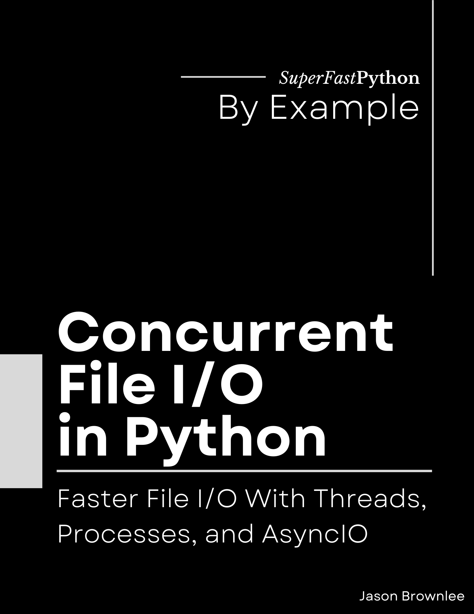

# Concurrent File I/O in Python

* <https://github.com/SuperFastPython/ConcurrentFileIOInPython>

This repository provides all source code for the book:

* **Concurrent File I/O in Python**: _Faster File I/O With Threads, Processes, and AsyncIO_, Jason Brownlee, 2023.

## Source Code
You can access all Python .py files directly here:

* [src/](src/)

## Get the Book

You can learn more about the book here:

* [Gumroad](https://superfastpython.gumroad.com/l/pcf)
* [Amazon Kindle](https://amzn.to/3OGrzg2)
* [Amazon Paperback](https://amzn.to/3P0Ll7j)
* [Google Books](http://books.google.com/books/about?id=TEnREAAAQBAJ)
* [Google Play](https://play.google.com/store/books/details?id=TEnREAAAQBAJ)
* [Goodreads](https://www.goodreads.com/book/show/197088434-concurrent-file-i-o-in-python)

### Book Blurb

> File I/O can be faster in Python when using concurrency.
>
> File I/O stands for File Input/Output, referring to the process of reading data from and writing data to files on a storage device like a hard drive.
>
> Studying how to bring concurrency to file I/O is critical for Python developers.
>
> File I/O operations are inherently slower compared to working with data in RAM, often becoming a significant bottleneck in many programs. By understanding concurrency and incorporating it into your file I/O tasks, you can unlock the full potential of modern computer hardware, making your applications more efficient and capable of handling large workloads.
>
> The problem is, there is no silver bullet. Each program and each task is different and unique. We cannot know which approach to Python concurrency will give good or even the best performance.
>
> Therefore in addition to learning how to perform file I/O operations concurrently, Python developers must learn how to benchmark a suite of different approaches to implementing file I/O operations concurrently.
>
> Introducing: "Concurrent File I/O in Python". A new book designed to teach you how to bring concurrency to your file I/O tasks in Python, super fast!
>
> You will get rapid-paced tutorials showing you how to bring concurrency to the most common file I/O tasks.
>
> Including:
>
> * How to perform file I/O operation in the background.
> * How to concurrently read files from disk and write files to disk.
> * How to concurrently delete files from disk.
> * How to concurrently copy, move, and rename files on disk.
> * How to efficiently append files on disk.
> * How to concurrently zip files and unzip files on disk.
>
> Don't worry if you are new to file I/O or concurrency, you will also get primers on the background required to get the most out of this book, including:
>
> * The importance of concurrency for high-performance file I/O.
> * How to perform common file I/O operations in Python.
> * How to use Python concurrency APIs including threading, multiprocessing, and asyncio.
> * How to perform file I/O with coroutines in asyncio using the aiofiles library.
> * How to use programming patterns for concurrent file I/O.
>
> Each tutorial is carefully designed to teach one critical aspect of how to bring concurrency to file I/O tasks.
>
> Stop copy-pasting code from StackOverflow answers.
>
> Learn Python concurrency correctly, step-by-step.

